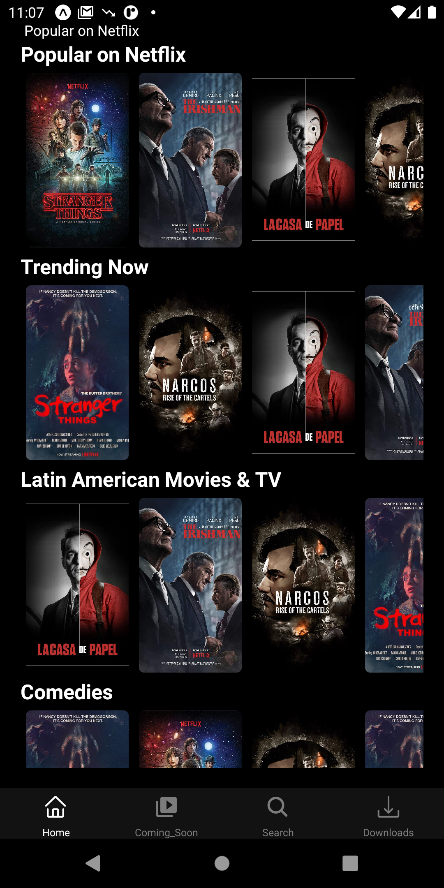
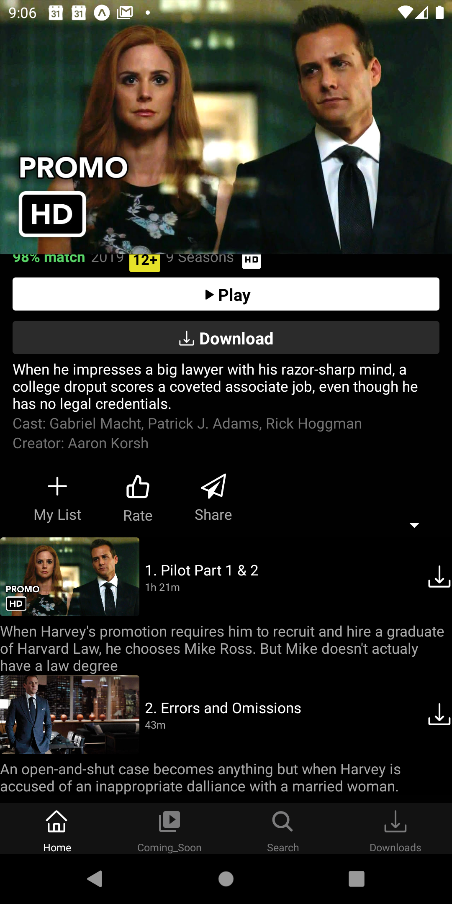

# Netflix
This project is a simplified front end clone of Netflix. It was created with React and CSS (Grid and Flexbox). It uses The MovieDB Api to search for movies and display details. Feel free to contribute!

Tools used:
Backend:  
GraphQL
AWS Storage
AWS Amplify

Front End:
React Native

Platform for the app : 
Android/IOS/IPAD/Android tablet

Runing Project Locally
Install dependencies: run npm install in root project

Run project: npm run dev
User Stories:
User can signin using quick authentication from AWS( phone number/ email)
User can search for movies and TV shows on TMDb
User can the see upcoming and trending movies. Data updates weekly
User can click on a movie and a modal should pop up. It should display the title, release date, overview, and runtime.
Watch the movie on the go 
In app subscription/payment ( in progress) 
The application adapts to any screen size. ( Android/ IOS)

Demo

